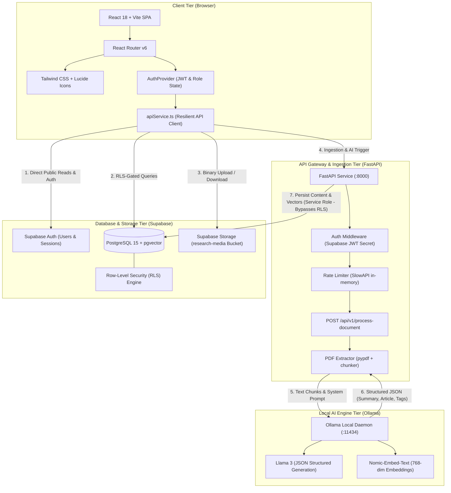
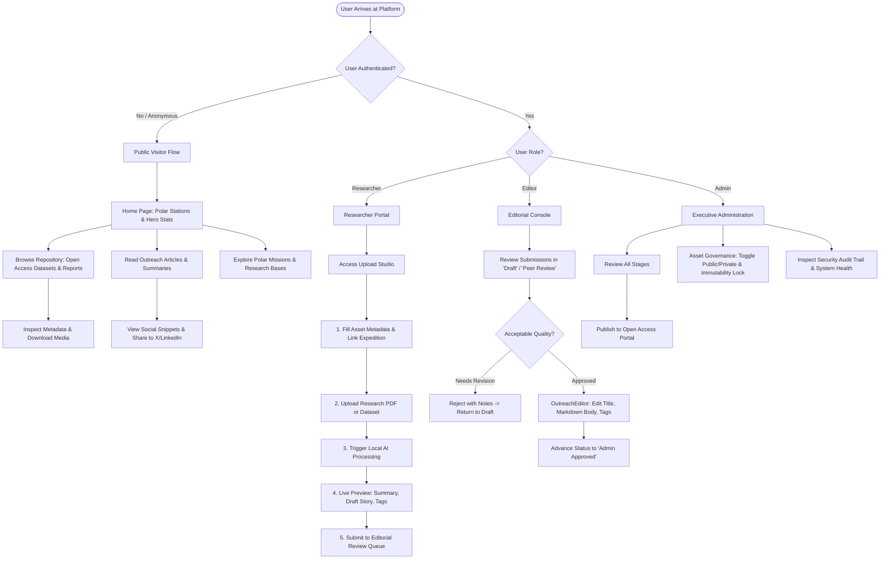
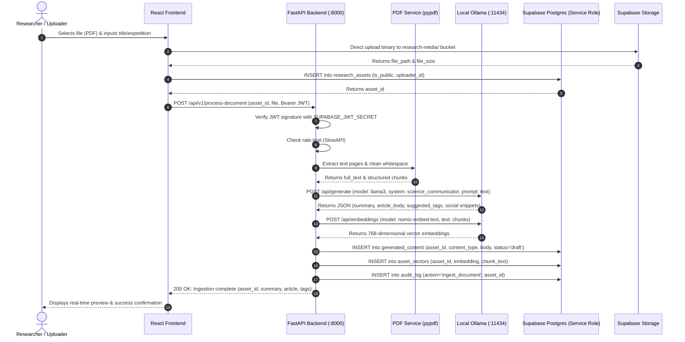
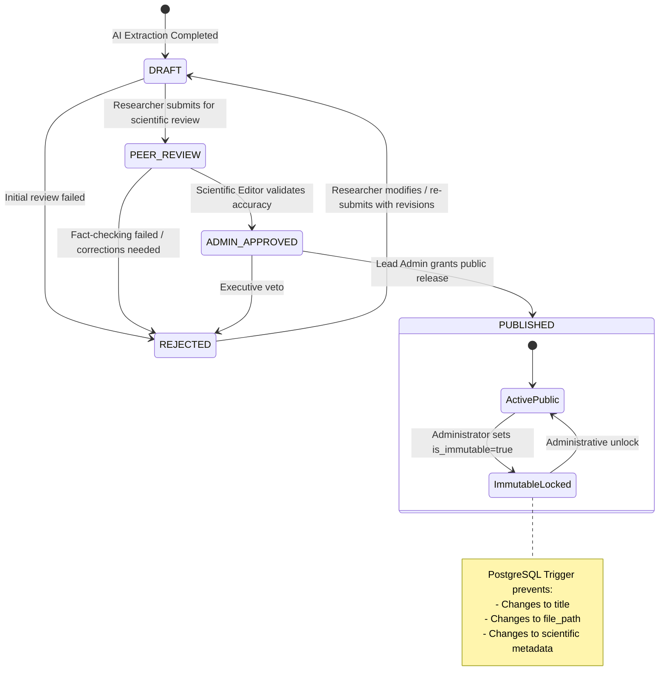
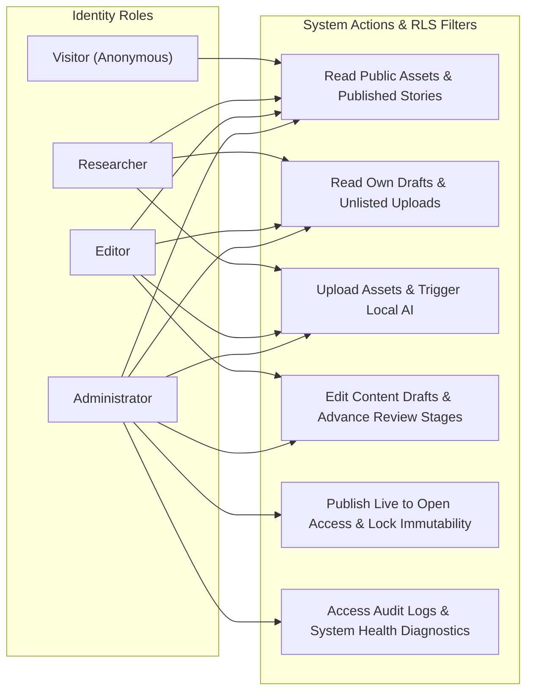
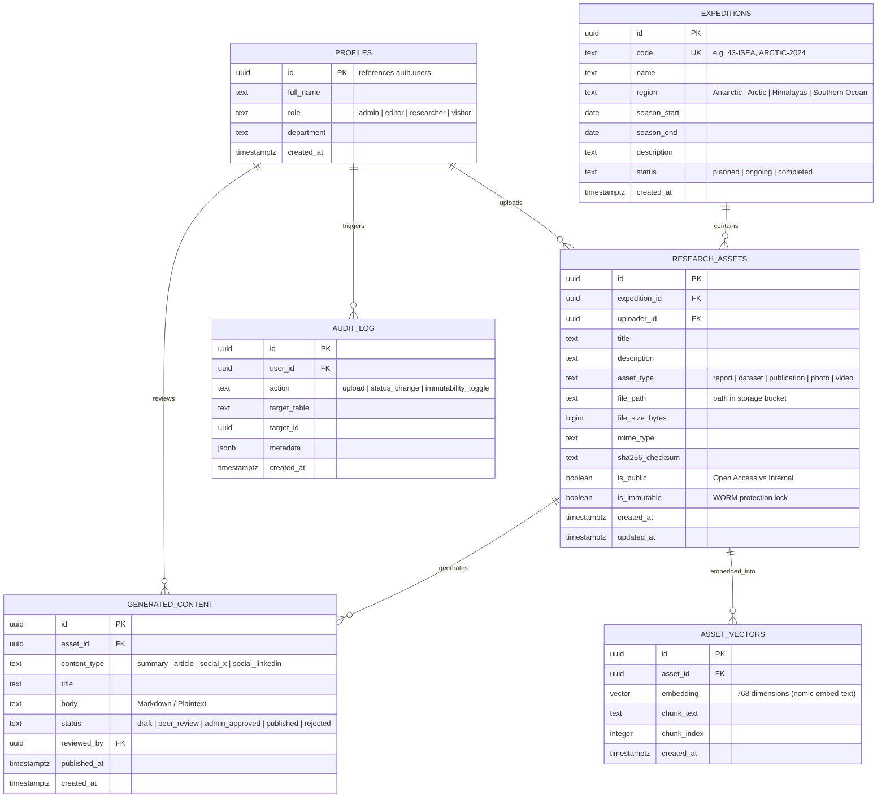
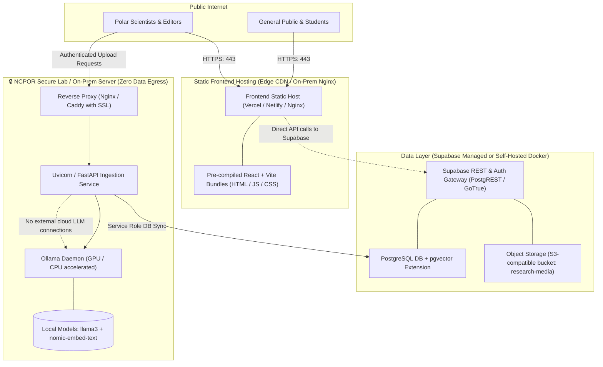

# NCPOR Polar Science Outreach Portal — System Diagrams & Flowcharts

This document provides visual diagrams and flowcharts for the **NCPOR Polar Science Outreach Platform (Icebound)**. All diagrams use standard [Mermaid.js](https://mermaid.js.org/) syntax and render natively in GitHub, GitLab, VS Code, and modern Markdown viewers.

---

## Table of Contents
1. [High-Level System Architecture](#1-high-level-system-architecture)
2. [End-to-End User Flow & Journey Maps](#2-end-to-end-user-flow--journey-maps)
3. [AI Document Ingestion & Transformation Sequence](#3-ai-document-ingestion--transformation-sequence)
4. [Editorial Content Lifecycle State Machine](#4-editorial-content-lifecycle-state-machine)
5. [Role-Based Access Control (RBAC) & Security Architecture](#5-role-based-access-control-rbac--security-architecture)
6. [Database Entity-Relationship (ER) Diagram](#6-database-entity-relationship-er-diagram)
7. [Deployment & Network Infrastructure Topology](#7-deployment--network-infrastructure-topology)

---

## 1. High-Level System Architecture

The NCPOR platform is organized into 4 distinct operational tiers designed for air-gapped security, zero external data leakage, and high performance.

---

## 2. End-to-End User Flow & Journey Maps

The platform caters to 4 distinct user roles: **Public Visitor**, **Researcher**, **Editor**, and **Administrator**.

---

## 3. AI Document Ingestion & Transformation Sequence

Sequence showing how raw scientific research papers are parsed, transformed by local AI, and indexed into the database without third-party cloud leakage.

---

## 4. Editorial Content Lifecycle State Machine

Outreach articles and generated content progress through a formal editorial pipeline before public syndication.

---

## 5. Role-Based Access Control (RBAC) & Security Architecture

Matrix showing permission boundaries enforced via **Supabase Row-Level Security (RLS)** in PostgreSQL and **Frontend Protected Routes**.

---

## 6. Database Entity-Relationship (ER) Diagram

Complete schema relational model as implemented in [`database/migrations/001_init.sql`](../database/migrations/001_init.sql).

---

## 7. Deployment & Network Infrastructure Topology

Deployment layout showing the air-gapped boundary between the public Internet, the static application hosting, and the secure internal AI computation nodes.

---

## Summary of Architectural Guarantees

1. **Air-Gapped AI Privacy**: Scientific reports uploaded to the platform are processed exclusively on the local Ollama instance on-premises. No proprietary research data or pre-publication findings are transmitted to third-party LLM APIs.
2. **Immutability Protection**: The database enforces integrity via automated triggers, ensuring historical scientific expedition records and publications cannot be altered once verified.
3. **Resilient Local Mode**: The frontend provides automatic local mock fallbacks for all endpoints, ensuring full demonstration capabilities during offline evaluations, hackathon judging, or disconnected expedition settings.
